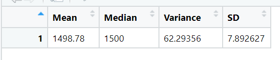
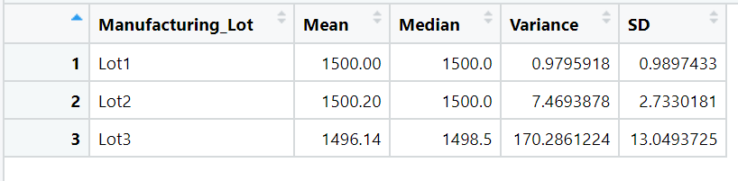
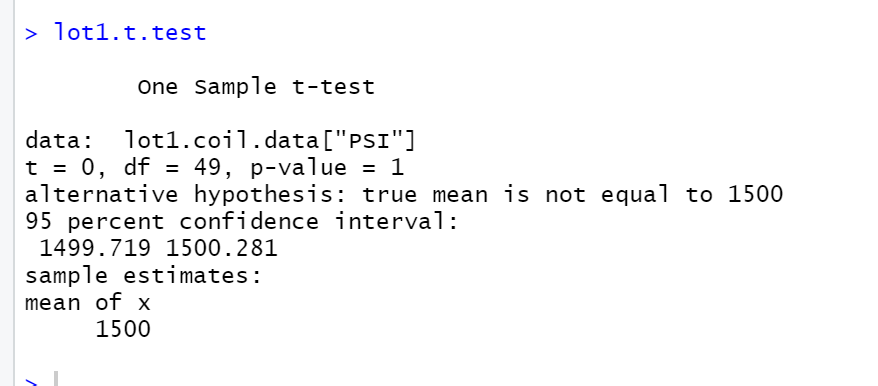
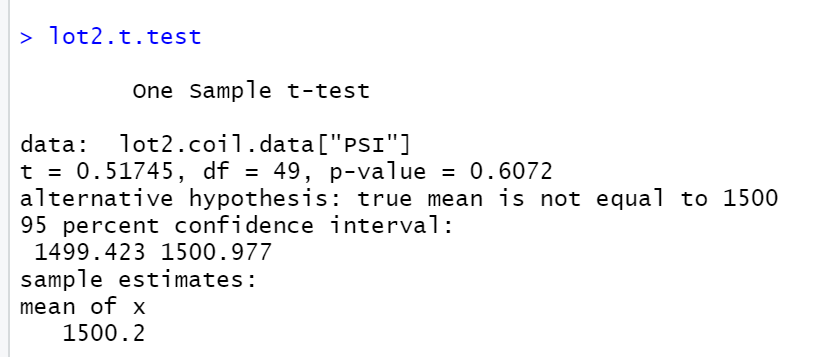
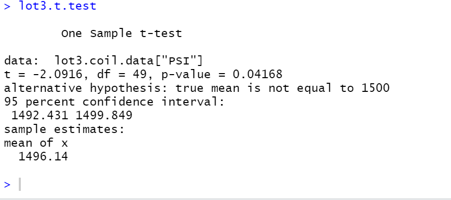

# MechaCar_Statistical_Analysis

## Linear Regression to Predict MPG

Based on the above linear regression summary, we do not have that great of a fit because the residual standard error is 8.774. However, this should be good enough for a "ballpark" estimate considering that mpg is relatively large compared to the standard deviation of residuals. Most variance comes from spoiler_angle, followed by vehicle_weight and AWD. The slope is nonzero because we have non-zero coefficients associated with each of the predictors. Our adjusted R-squared is nonetheless 0.6825 and non-adjusted R-squared is 0.7149, so the model is correct about 70% of the time, which I would consider a "good" fit.

## Summary Statistics on Suspension Coils

The overall mean and median for each lot and all data is roughly the same, at around 1500. However, the variance of Lot3 suspension coils significantly exceeds 100 at 170.29, so therefore the Lot3 suspension coils do not meet the design specification. However, the suspension coils in Lot1 and Lot2 do meet the design specification.

## T-Tests on Suspension Coils

Based on the t-tests, Lots 1 and 2 have large p-values over 0.05 (1 and 0.6072), so we fail to reject the null hypothesis and conclude that the mean PSI values for Lots 1 and 2 are probably equal to the population mean of 1500. However, the p-value for Lot 3 is 0.04168, so we reject the null hypothesis and conclude that the mean PSI value for Lot 3 is not 1500.

## Study Design: MechaCar vs Competition

In this study, I plan to compare miles per gallon (mpg) of MechaCar with its competition. The null hypothesis is that the mean mpg of both car models is the same, while the alternative hypothesis is that the means differ. I will use a two-sample t-test to test the hypothesis because a two-sample t-test is suitable for comparing the means of two data sets. In order to conduct this test, I will need a significant number of mpg observations from a set of cars from a brand that competes with MechaCar.
