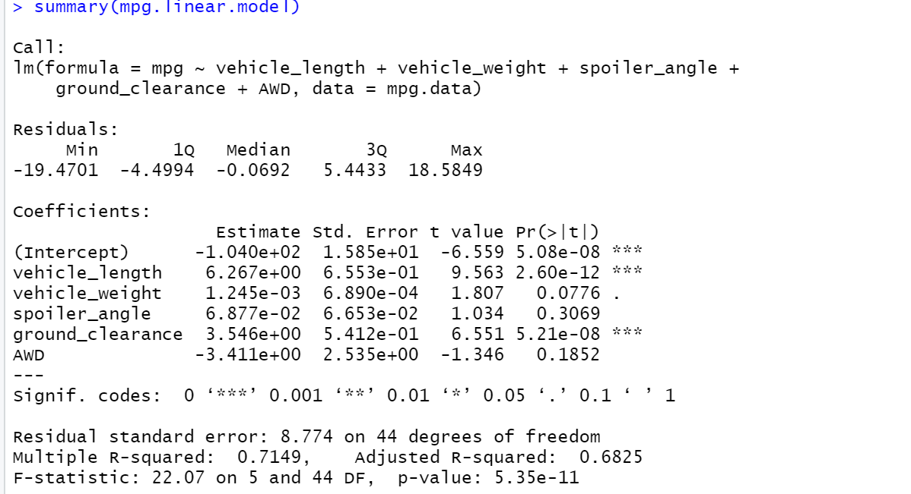

# MechaCar_Statistical_Analysis

## Linear Regression to Predict MPG

Based on the above linear regression summary, we do not have that great of a fit because the residual standard error is 8.774. However, this should be good enough for a "ballpark" estimate considering that mpg is relatively large compared to the standard deviation of residuals. Most variance comes from spoiler_angle, followed by vehicle_weight and AWD. The slope is nonzero because we have non-zero coefficients associated with each of the predictors. Our adjusted R-squared is nonetheless 0.6825 and non-adjusted R-squared is 0.7149, so the model is correct about 70% of the time, which I would consider a "good" fit.
